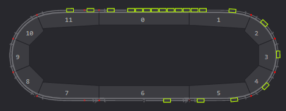

## ACPtrak Widget

Simple widget for animating ACPtrak shuttles in a mappView interface, with minimal configuration necessary.



---

### Built with

The widget is built entirely with JS, HTML, & CSS- without additional frameworks.

### To Use

  1. Copy the entire svg tag from the automatically generated track layout file (e.g. gAssembly_1.svg)
  2. Paste into **AnimWidget.html** between the `<!--	Insert here	-->` comments
  3. Add an ID attribute with the value *trackLayout* to the SVG tag:

```javascript
	<svg version="1.1" viewBox="-0.735577 -0.115 2.13115 0.86" id="trackLayout">
	...
```
  4. Add the **WidgetData** task to the Automation Studio project and enable var *animData* in OPCUA
  5. Add an HTML Viewer widget to the mappView project. Point it to **BRVisu/Media/AnimWidget.html**
